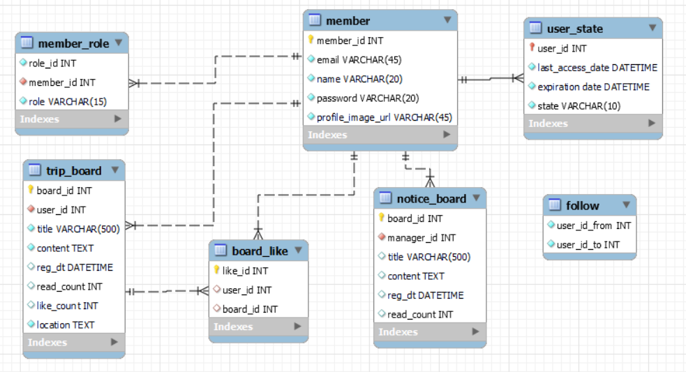

<div align="center">

# EnjoyTrip Backend

 <br>

 **📜프로젝트 기간** : 23.11.15  ~ 23.11.24 <br>
 **👩‍💻참여인원** : 2명  <br>
 **🏆수상** : [프로젝트 우수상 수상](./src/상장.jpg)  <br>

<br>

### 환경
| 항목| 설명 |
|:---|:---|
| 언어 및 프레임워크| Java 8, Spring Boot 2.7.17 |
| 데이터베이스 | MySQL 5.7.33 |
| 영속성 프레임워크 | JPA |
| 빌드 도구 | Gradle |
| 테스트 프레임워크 | JUnit |
| 런타임 환경 | OpenJDK 8 |
| 주요 라이브러리 | Gson 2.10.1 |
| 개발자 도구 및 플러그인 | Lombok, Spring Boot DevTools |


<br>
 
| 참여자 | 역할 |
|:---:|:-------|
|이형욱|로그인, 권한, 팔로우, 이메일을 통한 비밀번호 찾기|
|황진주|게시판, 좋아요, TMap API를 이용한 동작 구성|

</div>

<br><br>

## DB구성



<br><br>

## 환경구성

개인정보 보호를 위해 ```application.properties``` 파일을 올리지 않았습니다. <br>
아래 내용을 ```src\main\resources```에 위치시켜 주시기 바랍니다.
``` yaml
#datasource
spring.datasource.url=jdbc:mysql://localhost:3306/enjoytripfinal?serverTimezone=Asia/Seoul
spring.datasource.username={ DB접속 이름 }
spring.datasource.password={ DB접속 비밀번호 }
spring.datasource.driver-class-name=com.mysql.cj.jdbc.Driver

server.servlet.encoding.force-response=true

#JPA
#show SQL
spring.jpa.show-sql=true
# show Hibernate SQL
spring.jpa.properties.hibernate.format.sql=true

# Find Password Email Setting
# fill username & password
spring.mail.host=smtp.naver.com
spring.mail.port=465
spring.mail.username={ 네이버 email }
spring.mail.password={ 네이버 비밀번호 }
spring.mail.properties.mail.smtp.auth=true
spring.mail.properties.mail.smtp.ssl.enable=true
spring.mail.properties.mail.smtp.ssl.trust=smtp.naver.com
spring.mail.properties.mail.smtp.starttls.enable=true
```
<br><br>

## API List
: 사용된 API에 대해 정리합니다. 명시되지 않은 ```Map<String, String>```는 <br> 기본적으로 ```{"result": "success"}``` 혹은 ```{"result": "fail"}```로 해당 행위의 성공 여부를 알립니다.

### Email
 : auth/controller/EmailController.java

|Link|API|Return|Method|Description|
|:---:|:---:|:-----:|:---:|:---|
|/check/{email}|Get|Map<String, String>|registerEmailCheck|회원가입을 위한 Email 존재여부 확인|
|/check/findPassword|Post|Map<String, String>|findPassword|비밀번호 찾기를 위한 Email 존재여부 확인|

<br>

### Login
 : auth/controller/LoginController.java

|Link|API|Return|Method|Description|
|:---:|:---:|:-----:|:---:|:---|
|/login|Post|Map<String, String>|Login|사용자의 로그인 행위|
|/logout|Get|Map<String, String>|findPassword|사용자의 로그아웃 행위|
|/checkSession|Get|Map<String, String>|findPassword|사용자의 세션 존재 여부 확인 존재 시 회원정보(memberId, email, name, porfileImageUrl, role) 반환|

<br>

### Board
 : board/controller/BoardController.java

|Link|API|Parameter|Return|Method|Description|
|:---:|:---:|:---:|:-----:|:---:|:---|
|/tripBoard|Post|(BoardInsertDto, HttpSession)|Map<String, String>|Insert|게시글 등록|
|/tripBoard/{boardId}|Get|Integer|Board|Detail|특정 게시글에 대한 세부 정보 조회|
|/tripBoard/all|Post|(BoardFindAllDto)|Map<String, String>|FindAll|특정페이지의 게시글 조회 후 게시글 정보(board, totalPages, totalElements)반환|
|/tripBoard/check|Post|BoardMatchDto, HttpSession|Boolean|IsWriter|특정 게시글에 대한 세부 정보 조회|


